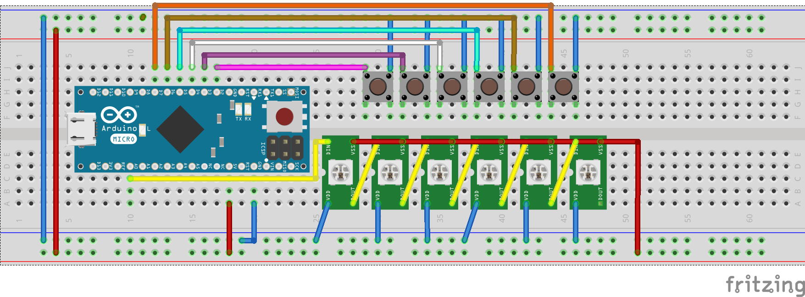

# Keykeep — стартап по разработке hotkey-клавиатуры, предназначенной для сокращения х.
Doorblu - это работающая в автономном режиме система, которая способна определить, находится ли поблизости ключ, привязанный к ней, и в случае успеха позволить открыть дверь. При этом доставать и держать его в руке необязательно: достаточно просто находиться на небольшом расстоянии от встроенной в дверь системы. Не придётся тратить время на поиск ключа или ждать, пока хозяин подойдёт и откроет дверь: c Doorblu попасть домой станет гораздо проще!

Обнаружив прикосновение к ручке двери, сенсорный переключатель подаст сигнал на МК(микроконтроллер). МК при помощи Bluetooth-модуля получит список находящихся рядом Bluetooth-устройств с силой сигнала, указанной в системе. Среди найденных устройств МК будет искать адреса, сохранённые в памяти. В случае успеха контроллер подаст сигнал на сервопривод, который отвечает за состояние дверного затвора, и дверь будет открыта. В случае отсутствия у пользователя возможности открыть дверь приведённым выше способом, он также может попасть внутрь, введя верный пин-код на матричной клавиатуре. Через некоторое время бездействия затвор сам вернётся в изначальное закрытое положение.
.

### Распиновка для макета, который был собран для конкурса.

